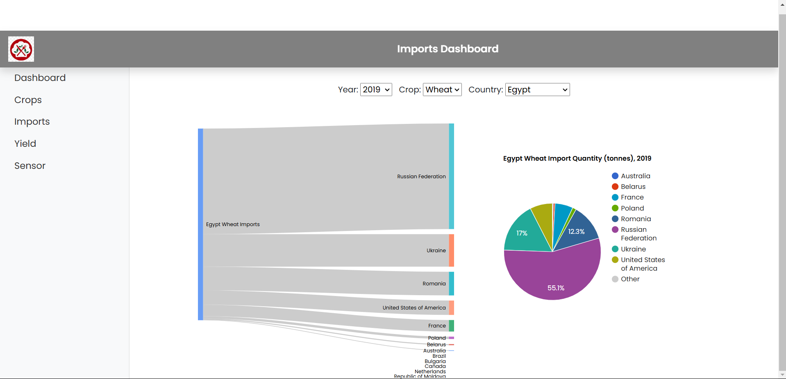
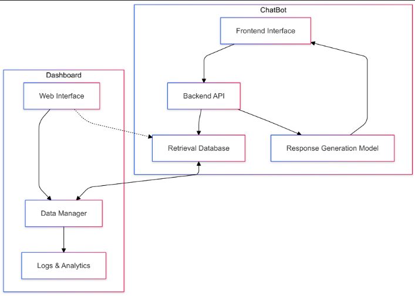

# Hackathon - Time Series Web UI Modeling and RAG architecture - the State of Food Security and Nutrition 2024

## Table of Contents

- [Project Description](#project-description)
  - [Key Features](#key-features)
  - [Technologies Used](#technologies-used)
- [Setup Instructions](#setup-instructions)
  - [1. Clone the Repository](#1-clone-the-repository)
  - [2. Install Dependencies](#2-install-dependencies)
    - [Frontend](#frontend)
    - [Backend](#backend)
    - [Python Requirements](#python-requirements)
  - [3. Set Up Environment Variables](#3-set-up-environment-variables)
  - [4. Run RabbitMQ](#4-run-rabbitmq)
  - [5. Start the Application](#5-start-the-application)
- [Usage](#usage)
  - [Features](#features)
  - [Interacting with the Chat Assistant](#interacting-with-the-chat-assistant)
- [Output Screenshots](#output-screenshots)
  - [User Prompt Queue](#user-prompt-queue)
  - [Chat Response](#chat-response)
  - [Response Queue](#response-queue)

## Project Description

This project is an AI-powered interactive chat assistant designed to provide insights and answer questions related to the economic and social sustainability of marginalized and highly vulnerable communities. It serves as a valuable tool for researchers, policymakers, and community members seeking to understand and address the challenges faced by these communities.

### Key Features

- **Real-Time Chat Interface**: Engages users with a seamless chat experience, displaying user prompts on the right and assistant responses on the left within a dark-themed UI.
- **Contextual Knowledge Retrieval**: Leverages preloaded documents to provide accurate and relevant responses to user queries.
- **Distributed System Architecture**: Utilizes RabbitMQ for efficient communication between frontend, backend, and AI components, ensuring scalability and reliability.
- **Natural Language Processing (NLP)**: Employs OpenAI’s GPT model to understand and generate human-like responses based on the context provided.
- **Scalable and Modular Design**: Built with modern technologies to facilitate easy maintenance and future enhancements.

### Technologies Used

- **Frontend**:
  - **React**: For building the user interface.
  - **Socket.IO (Client)**: Enables real-time, bidirectional communication between the client and server.
  - **Axios**: For handling HTTP requests.
  - **CSS**: Styling the application with a dark theme.

- **Backend**:
  - **Node.js & Express**: For setting up the server and handling API requests.
  - **Socket.IO (Server)**: Facilitates real-time communication with the frontend.
  - **Python**: Handles backend processing tasks.
  - **LangChain**: A framework for developing applications powered by language models.
  - **OpenAI API**: Provides access to the GPT model for generating responses.
  - **RabbitMQ**: Manages message queuing between different components of the application.

- **Queue Management**:
  - **RabbitMQ**: Ensures efficient and reliable message passing within the distributed system.

- **AI and NLP**:
  - **OpenAI GPT Model**: Processes and generates natural language responses based on user input and contextual data.

## Setup Instructions

Follow these steps to set up and run the project on your local machine.

### 1. Clone the Repository

Begin by cloning the repository to your local machine using Git.

```bash
git clone https://github.com/malluriaravind/CMPE280-HACKATHON
cd CMPE280-HACKATHON
```
2. **Install Dependencies**
Install the necessary dependencies for both the frontend and backend components.

**Frontend**
Navigate to the frontend directory and install the dependencies using npm.

```
cd frontend
npm install
Backend
```
Navigate to the backend directory and install the dependencies.

```
cd ../backend
npm install
Python Requirements
```
Ensure you have Python installed (preferably Python 3.8 or higher). Install the required Python packages using pip.

bash
```
pip install -r requirements.txt
```
**Note**: If you encounter permission issues, you might need to use pip install --user -r requirements.txt or consider using a virtual environment.

**3. Set Up Environment Variables**
Create a .env file in both the backend and Python project directories to store sensitive information and configuration settings.

Backend .env
Navigate to the backend directory and create a .env file with the following variables:

env
```
RABBITMQ_URL=amqp://localhost
OPENAI_API_KEY=your_openai_api_key
PORT=5000
```
In the root directory or the specific Python project directory, create another .env file:

env
```
RABBITMQ_URL=amqp://localhost
OPENAI_API_KEY=your_openai_api_key
DOCUMENTS_PATH=pdfs
```
Security Tip: Never commit your .env files to version control. Ensure they are listed in your .gitignore file.

**4. Run RabbitMQ**
RabbitMQ is essential for managing the message queue between different parts of the application. You can run RabbitMQ using Docker or install it directly on your system.

Using Docker
If you have Docker installed, run the following command to start RabbitMQ with the management plugin:

bash
Copy code
docker run -d --hostname my-rabbit --name some-rabbit -p 5672:5672 -p 15672:15672 rabbitmq:3-management
5672: Default port for AMQP protocol.
15672: Port for the RabbitMQ management UI.
Access the management UI by navigating to http://localhost:15672 in your browser. The default credentials are:

Username: guest
Password: guest
Direct Installation
Alternatively, you can install RabbitMQ directly on your machine. Refer to the official RabbitMQ installation guide for instructions specific to your operating system.

**5. Start the Application**
Start each component of the application in the following order to ensure proper communication.

**Start the Python Backend**
This service handles document processing and interacts with the GPT model.

```
python pdf_qa_backend.py
```
**Troubleshooting:** Ensure that all Python dependencies are installed and that RabbitMQ is running before starting the backend.

**Start the Node.js Server**
Navigate to the backend directory if not already there and start the server.

```
cd backend
node server.js
```
**Note**: The server listens on the port specified in the .env file (default is 5000).

**Start the React Frontend**
Open a new terminal window, navigate to the frontend directory, and start the frontend application.

```
cd frontend
npm start
```
The frontend should automatically open in your default browser at http://localhost:3000. If it doesn't, you can manually navigate to this URL.

**Usage**
Once the application is up and running, you can interact with the chat assistant to gain insights into the economic and social sustainability of marginalized and highly vulnerable communities.

**Features**
**Interactive Chat:** Engage in real-time conversations with the assistant.
**Contextual Responses:** Receive answers based on the documents and data provided.
**Real-Time Updates:** Experience seamless communication with instant responses.
**Interacting with the Chat Assistant**
**Ask Questions:** Locate the input box at the bottom of the chat interface. Type your question related to sustainability issues affecting marginalized communities.


**Submit Your Query:** Press Enter or click the send button to submit your question.

**View Responses:** The assistant will process your query and display a response on the left side of the chat interface.

**Review Queues:** If needed, you can view the state of the message queues through the provided screenshots or access the RabbitMQ management UI for more details.

**Output Screenshots**
Below are example screenshots illustrating the various states of the application, including message queues and chat interactions.

Chat-Interface
An example of the assistant's response to a user query within the chat interface.


User Prompt Queue
This screenshot shows the messages waiting in the user prompt queue, awaiting processing by the backend.


Response Queue
Displays the messages waiting in the response queue before being delivered to the frontend.


Hackathon - Time Series Web UI Modeling and RAG Architecture - The State of Food Security and Nutrition 2024
Table of Contents
Project Description
Key Features
Technologies Used
Setup Instructions
1. Clone the Repository
2. Install Dependencies
Frontend
Backend
Python Requirements
3. Set Up Environment Variables
4. Run RabbitMQ
5. Start the Application
Usage
Features
Interacting with the Chat Assistant
Output Screenshots
User Prompt Queue
Chat Response
Response Queue
Project Description
This project is an AI-powered interactive chat assistant designed to provide insights and answer questions related to the economic and social sustainability of marginalized and highly vulnerable communities. It serves as a valuable tool for researchers, policymakers, and community members seeking to understand and address the challenges faced by these communities.

Key Features
Real-Time Chat Interface: Engages users with a seamless chat experience, displaying user prompts on the right and assistant responses on the left within a dark-themed UI.
Contextual Knowledge Retrieval: Leverages preloaded documents to provide accurate and relevant responses to user queries.
Distributed System Architecture: Utilizes RabbitMQ for efficient communication between frontend, backend, and AI components, ensuring scalability and reliability.
Natural Language Processing (NLP): Employs OpenAI’s GPT model to understand and generate human-like responses based on the context provided.
Scalable and Modular Design: Built with modern technologies to facilitate easy maintenance and future enhancements.
Technologies Used
Frontend:

React: For building the user interface.
Socket.IO (Client): Enables real-time, bidirectional communication between the client and server.
Axios: For handling HTTP requests.
CSS: Styling the application with a dark theme.
Backend:

Node.js & Express: For setting up the server and handling API requests.
Socket.IO (Server): Facilitates real-time communication with the frontend.
Python: Handles backend processing tasks.
LangChain: A framework for developing applications powered by language models.
OpenAI API: Provides access to the GPT model for generating responses.
RabbitMQ: Manages message queuing between different components of the application.
Queue Management:

RabbitMQ: Ensures efficient and reliable message passing within the distributed system.
AI and NLP:

OpenAI GPT Model: Processes and generates natural language responses based on user input and contextual data.
Setup Instructions
Follow these steps to set up and run the project on your local machine.

1. Clone the Repository
Begin by cloning the repository to your local machine using Git.

bash
Copy code
git clone https://github.com/malluriaravind/CMPE280-HACKATHON
cd CMPE280-HACKATHON
2. Install Dependencies
Frontend
Navigate to the frontend directory and install the dependencies using npm.

bash
Copy code
cd frontend
npm install
Backend
Navigate to the backend directory and install the dependencies.

bash
Copy code
cd ../backend
npm install
Python Requirements
Ensure you have Python installed (preferably Python 3.8 or higher). Install the required Python packages using pip.

bash
Copy code
pip install -r requirements.txt
Note: If you encounter permission issues, you might need to use pip install --user -r requirements.txt or consider using a virtual environment.

3. Set Up Environment Variables
Create a .env file in both the backend and Python project directories to store sensitive information and configuration settings.

Backend .env
Navigate to the backend directory and create a .env file with the following variables:

env
Copy code
RABBITMQ_URL=amqp://localhost
OPENAI_API_KEY=your_openai_api_key
PORT=5000
Python .env
In the root directory or the specific Python project directory, create another .env file:

env
Copy code
RABBITMQ_URL=amqp://localhost
OPENAI_API_KEY=your_openai_api_key
DOCUMENTS_PATH=pdfs
Security Tip: Never commit your .env files to version control. Ensure they are listed in your .gitignore file.

4. Run RabbitMQ
RabbitMQ is essential for managing the message queue between different parts of the application. You can run RabbitMQ using Docker or install it directly on your system.

Using Docker
If you have Docker installed, run the following command to start RabbitMQ with the management plugin:

bash
Copy code
docker run -d --hostname my-rabbit --name some-rabbit -p 5672:5672 -p 15672:15672 rabbitmq:3-management
5672: Default port for AMQP protocol.
15672: Port for the RabbitMQ management UI.
Access the management UI by navigating to http://localhost:15672 in your browser. The default credentials are:

Username: guest
Password: guest
5. Start the Application
Start each component of the application in the following order to ensure proper communication.

Start the Python Backend
This service handles document processing and interacts with the GPT model.

bash
Copy code
python pdf_qa_backend.py
Start the Node.js Server
Navigate to the backend directory if not already there and start the server.

bash
Copy code
cd backend
node server.js
Start the React Frontend
Open a new terminal window, navigate to the frontend directory, and start the frontend application.

bash
Copy code
cd frontend
npm start
The frontend should automatically open in your default browser at http://localhost:3000. If it doesn't, you can manually navigate to this URL.

Usage
Once the application is up and running, you can interact with the chat assistant to gain insights into the economic and social sustainability of marginalized and highly vulnerable communities.

Features
Interactive Chat: Engage in real-time conversations with the assistant.
Contextual Responses: Receive answers based on the documents and data provided.
Real-Time Updates: Experience seamless communication with instant responses.
Interacting with the Chat Assistant
Ask Questions: Locate the input box at the bottom of the chat interface. Type your question related to sustainability issues affecting marginalized communities.
Submit Your Query: Press Enter or click the send button to submit your question.
View Responses: The assistant will process your query and display a response on the left side of the chat interface.

Dashboard:
Macroeconomic Researcher Food Security Time Series Dashboard
Overview
This dashboard is an interactive tool designed for researchers and policymakers to explore time-series data on food security and macroeconomic indicators. It provides a streamlined interface to analyze and visualize key metrics, enabling better insights into the state of food security and nutrition from 1961 to 2020.

Key Features
Navigation Menu:

Macroeconomic Indicators: Access GDP, FDI inflows, and FDI outflows in USD.
Agriculture: View agriculture-related data critical to food security.
Debt Services: Analyze debt-related metrics affecting economic sustainability.
Imports/Exports: Explore trade data for understanding dependencies and trends.
Time Series Filter:

A year range slider (1961–2020) allows users to filter data for specific time periods, providing flexibility in analysis.
Graph Interaction Area:

Users can drag and drop data options to visualize corresponding trends and relationships dynamically.
Annotation Tool:

Easily annotate key insights or trends directly on the dashboard for better communication and record-keeping.
Chat Assistant:

A dedicated AI-powered assistant to answer queries or provide additional insights related to the displayed data.
Screenshot

Technologies Used
Frontend: React, CSS, Javascript(dark theme)
Backend: Node.js, Python, RabbitMQ
Database: Time-series and economic data sources
Visualization: Dynamic graphs and charts with drag-and-drop functionality
AI Assistant: OpenAI API integration for real-time responses
Use Cases
Macroeconomic Analysis: Understand the impact of economic indicators on food security over time.
Policy Development: Equip decision-makers with visual insights to craft sustainable policies.
Research: Support academic and organizational research on food security and nutrition.
How to Use
Select Indicators:

Use the menu to choose relevant data categories such as macroeconomics, agriculture, debt services, or imports/exports.
Filter Time Period:

Adjust the year range slider to refine your analysis to a specific time period.
Visualize Trends:

Drag and drop desired metrics into the graph area to generate visualizations.
Chat for Insights:

Use the AI chat assistant for additional context or to resolve queries about the data.
Annotate Key Findings:

Use the annotation tool to highlight critical insights directly on the dashboard.

Main Dashboard Page: 

Time Series Data:

Imports Exports Page:


In our code, we have also implemented RAG architecture(Retrieval Augmented Generation)
Here is a diagram representing the RAG architecture we implemented in our code for the 280 hackathon. 

